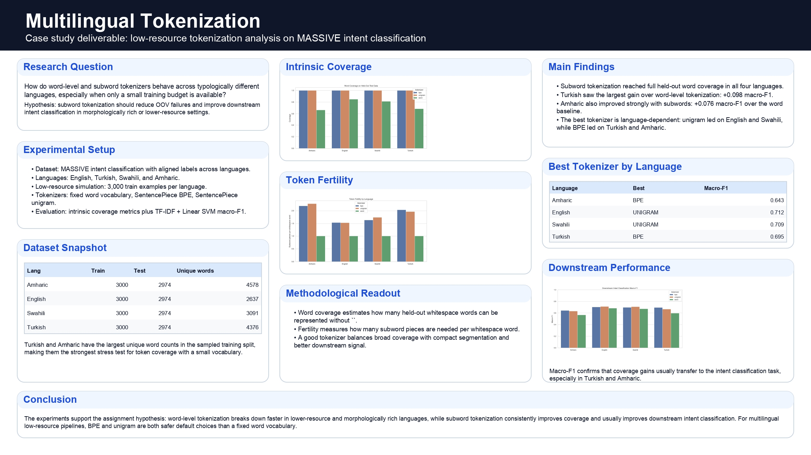

# Multilingual Tokenization Case Study

This repository contains a case study submission on **Multilingual Tokenization**.

## Final Scope

- Dataset: `mteb/MassiveIntentClassification`
- Languages: English, Turkish, Swahili, Amharic
- Train size: 3,000 examples per language
- Tokenizers: word-level, SentencePiece BPE, SentencePiece unigram
- Downstream evaluation: TF-IDF + Linear SVM intent classification

## Deliverables

- `notebooks/multilingual_tokenization_case_study.ipynb`  
  Main notebook with the methodology, metrics, and experiment summary.

- `poster/multilingual_tokenization_poster.pdf`  
  Poster covering motivation, methodology, results, and conclusions.

- `run_case_study.py`  
  Reproducible experiment pipeline that trains tokenizers, evaluates them, and exports metrics/figures.

- `outputs/data/*.csv`  
  Experiment tables used in the analysis.

- `outputs/figures/*.png`  
  Plots for coverage, fertility, and downstream performance.

## Experiment Design

- Dataset: `mteb/MassiveIntentClassification`
- Languages: English, Turkish, Swahili, Amharic
- Task: intent classification
- Low-resource setup: 3,000 training examples per language
- Tokenizers:
  - word-level baseline
  - SentencePiece BPE
  - SentencePiece unigram
- Downstream model: TF-IDF + Linear SVM

## Main Findings

- Subword tokenization reached full held-out word coverage in all four languages.
- Word-level tokenization had the worst OOV behavior in Turkish and Amharic.
- Best downstream tokenizers:
  - English: unigram (`0.712` macro-F1)
  - Turkish: BPE (`0.695` macro-F1)
  - Swahili: unigram (`0.709` macro-F1)
  - Amharic: BPE (`0.643` macro-F1)
- The largest improvement over the word baseline appeared in Turkish, where the best subword tokenizer improved macro-F1 by about `0.098`.



## Reproduction

Install the required packages, then run:

```bash
python run_case_study.py
```

The command regenerates all metrics, tokenizers, and figures.

If you just want to inspect the project interactively, open `notebooks/multilingual_tokenization_case_study.ipynb` and run the cells in order.
